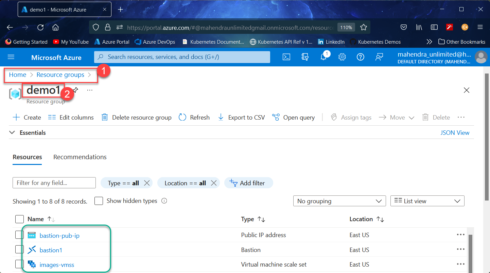
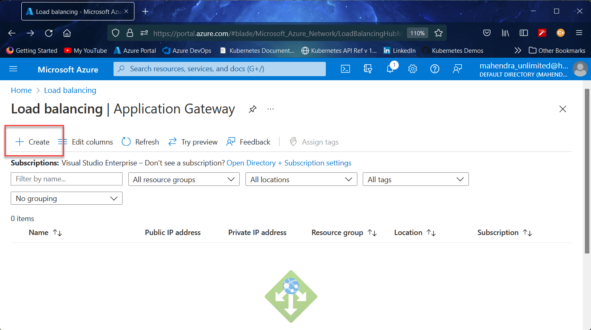
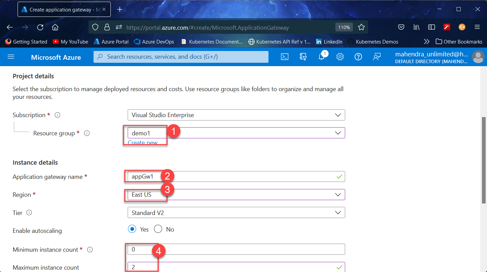
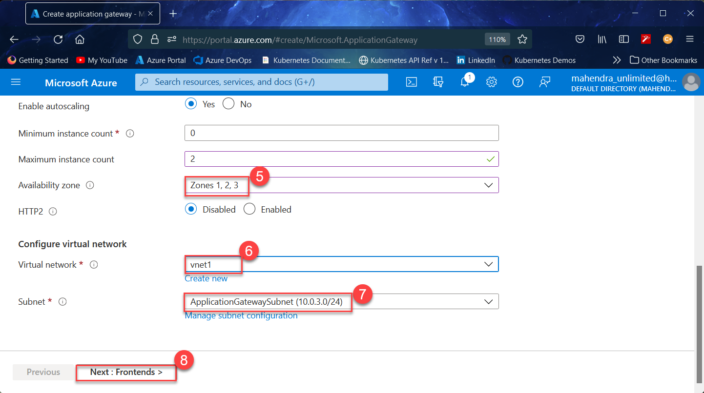
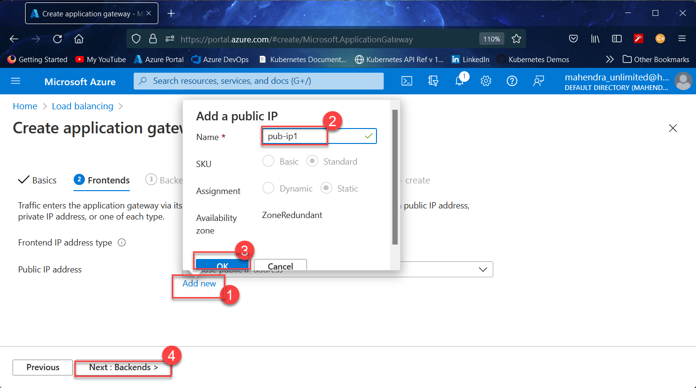

# azure-app-gateway-demo
Azure Application Gateway demo. Uses path based routing to direct traffic to one of the two backend pools.

> The ARM Template included in this repository, does not deploy any Application Gateway, I have `deliberately` not included Application Gateway in side the template so that You need to deploy `Application Gateway` Using `Azure Portal` instead.

## How to use the ARM-Template ?

1.	Login into [Azure Portal](https://portal.azure.com) 
1.	Launch `Cloud Shell` from the portal.
1.	Using `Bash` Mode, enter following commands to create the `resource group` and then `deploy template`
	> Feel free to change values for `Location` and `Resource Group Name`

	```bash
	az group create -n demo1 -l eastus
	```

	```bash
	az deployment group create --name d1 --template-uri https://raw.githubusercontent.com/mahendra-shinde/azure-app-gateway-demo/main/ARM-Template/azuredeploy.json --parameters https://raw.githubusercontent.com/mahendra-shinde/azure-app-gateway-demo/main/ARM-Template/azuredeploy.parameters.json -g demo1
	```

1.	Once the template deployment is finished, proceed to `Azure Portal` to manually create `Application Gateway` 

## How to deploy the Application Gateway and Add both VMSS as two back-end pools.

1.	Goto newly deployed resource group `demo1` (created by previous steps)
	

1.	Now, Use following steps to locate `Application Gateways` in azure portal
	

	1.	Search for `App Gw` in top search bar
	
	1.	Select "Application Gateways" from the search result


1.	Click on `Create` button as shown below.
	

1.	Now, fill up information in first tab like below:
	
	
	1.	Resource group: enter resource group created earlier.
	1.	Application Gateway Name: `appGw1`
	1.	Region : select the same region as resource group
	1.	Minimum Instance : 0
	1.	Maximum Instance: 2

1.	Continuing from previous step to create new application gateway
	
	6.	Select All Availability zone

	7.	Choose the "VNet1" (created by template)

	8.	Select Subnet "ApplicationGatewaySubnet"

	9.	Click `Next: Frontends` button

1.	Now, you need to define a public ip for Application gateway
	
	1.	Click `Add New` button
	1.	Enter name for public ip
	1.	Click `OK`
	1.	Click `Next: Backends` button

1.	Define the backends now:
	
	
	1.	Click on `Add Backend Pool` link
	1.	Enter name of pool `image-pool`
	1.	Select `VMSS` and then `images-vmss` (created by ARM-Template)
	1.	Click `Add` button

1.	

1.	

1.	

1.	

1.	

1.	

1.	

1.	

1.	

1.	

1.	

1.	

1.	

1.	

1.	

1.	

1.	