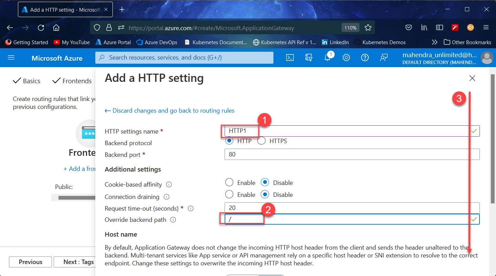
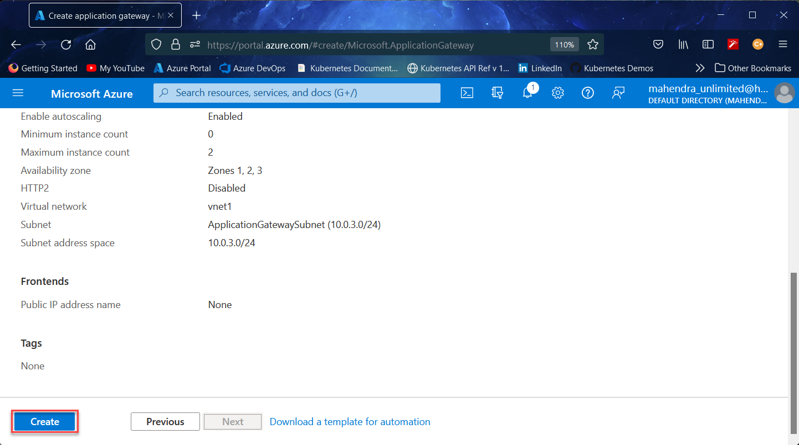

# azure-app-gateway-demo
Azure Application Gateway demo. Uses path based routing to direct traffic to one of the two backend pools.

> The ARM Template included in this repository, does not deploy any Application Gateway, I have `deliberately` not included Application Gateway in side the template so that You need to deploy `Application Gateway` Using `Azure Portal` instead.

## How to use the ARM-Template ?

1.	Login into [Azure Portal](https://portal.azure.com) 
1.	Launch `Cloud Shell` from the portal.
1.	Using `Bash` Mode, enter following commands to create the `resource group` and then `deploy template`
	> Feel free to change values for `Location` and `Resource Group Name`

	```bash
	az group create -n demo1 -l eastus
	```

	```bash
	az deployment group create --name d1 --template-uri https://raw.githubusercontent.com/mahendra-shinde/azure-app-gateway-demo/main/ARM-Template/azuredeploy.json --parameters https://raw.githubusercontent.com/mahendra-shinde/azure-app-gateway-demo/main/ARM-Template/azuredeploy.parameters.json -g demo1
	```

1.	Once the template deployment is finished, proceed to `Azure Portal` to manually create `Application Gateway` 

## How to deploy the Application Gateway and Add both VMSS as two back-end pools.

1.	Launch azure cloud shell once again to create `Application Gateway` using following script.

	```bash
	az network public-ip create --resource-group demo1 --name pub1
	az network application-gateway create \
		--name app-gw1 \
		--location eastus \
		--resource-group demo1 \
		--vnet-name vnet1 \
		--subnet ApplicationGatewaySubnet \
		--capacity 2 \
		--sku Standard_Small \
		--http-settings-cookie-based-affinity Disabled \
		--frontend-port 80 \
		--http-settings-port 80 \
		--http-settings-protocol Http \
		--public-ip-address pub1 --priority 1001
	```
1.	In Azure portal, search for Application Gatewat
	

1.	Define the backends now:
	
	
	1.	Click on `Add Backend Pool` link
	1.	Enter name of pool `image-pool`
	1.	Select `VMSS` and then `images-vmss` (created by ARM-Template)
	1.	Click `Add` button

1.	

1.	

1.	

1.	

1.	

1.	

1.	

1.	

1.	

1.	

1.	

1.	

1.	

1.	

1.	

1.	

1.	